# 15 Opus 5.5 builds — variations

Fifteen builds made with Claude Opus 5.5. Each one is a **variation** of a build from the video
[**Top 15 Things built with Claude OPUS 5.5**](https://www.youtube.com/watch?v=dw4rYWy8nLw) by **Code Bear** on YouTube.

A variation keeps the technique and the look of the original and changes the subject.
For example, the original #6 is "The Minecraft Test"; the variation is "The Volcano Test".
These are not copies of the original builds. Every original belongs to its creator (see "Original" under each build).

The prompts and the pass checks for all 15 builds are in [`opus55-15-variations-specs.html`](https://az9713.github.io/opus-5.5-builds/opus55-15-variations-specs.html).

## Play them

**Dashboard: [az9713.github.io/opus-5.5-builds](https://az9713.github.io/opus-5.5-builds/)** — all 15 builds on one page.

Or click a screenshot below. Each one opens the live build on GitHub Pages.

<table>
<tr>
<td width="33%" valign="top"><a href="https://az9713.github.io/opus-5.5-builds/builds/01-eye-lab/index.html">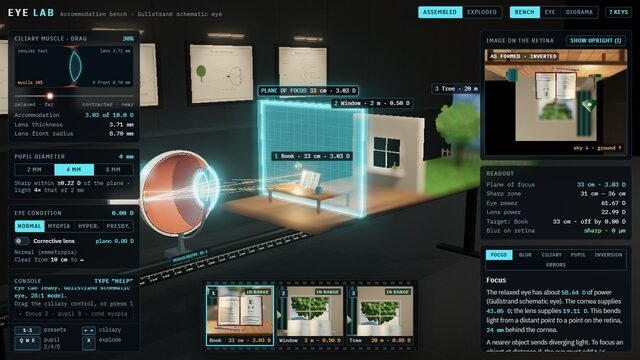</a><br><b>#1 <a href="https://az9713.github.io/opus-5.5-builds/builds/01-eye-lab/index.html">Eye Lab</a></b> — ▶ Play<br>How the human eye focuses (3D)<br><sub>Original: Lens Lab, by <a href="https://x.com/RyanSael">@RyanSael</a></sub></td>
<td width="33%" valign="top"><a href="https://az9713.github.io/opus-5.5-builds/builds/02-clawd-goes-to-sea/out/clawd-goes-to-sea.mp4">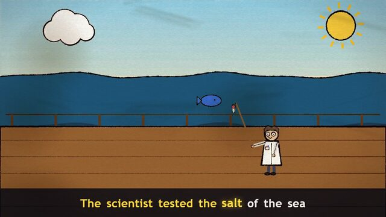</a><br><b>#2 <a href="https://az9713.github.io/opus-5.5-builds/builds/02-clawd-goes-to-sea/out/clawd-goes-to-sea.mp4">Clawd Goes to Sea</a></b> — ▶ Watch<br>Music video, a sea shanty composed in code (150 s)<br><sub>Original: Clawd music video, by <a href="https://x.com/other__reality">@other__reality</a></sub></td>
<td width="33%" valign="top"><a href="https://az9713.github.io/opus-5.5-builds/builds/03-water-weather-code/index.html">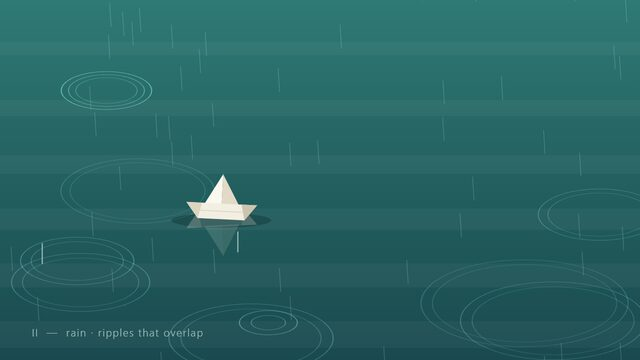</a><br><b>#3 <a href="https://az9713.github.io/opus-5.5-builds/builds/03-water-weather-code/index.html">Small Weather</a></b> — ▶ Play<br>Short film in code, water and weather patterns<br><sub>Original: Short film in code, by <a href="https://x.com/devteamdrew">@devteamdrew</a></sub></td>
</tr>
<tr>
<td width="33%" valign="top"><a href="https://az9713.github.io/opus-5.5-builds/builds/04-title-sequence/index.html">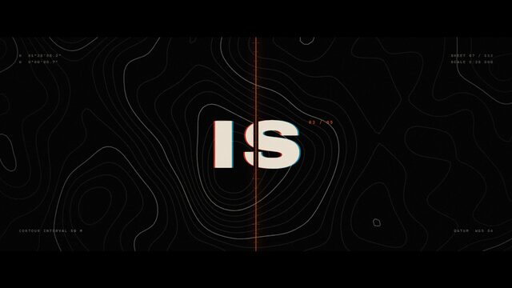</a><br><b>#4 <a href="https://az9713.github.io/opus-5.5-builds/builds/04-title-sequence/index.html">Meridian</a></b> — ▶ Play<br>One-prompt film title sequence (15 s)<br><sub>Original: Motion showreel, by <a href="https://x.com/stephanlivera">@stephanlivera</a></sub></td>
<td width="33%" valign="top"><a href="https://az9713.github.io/opus-5.5-builds/builds/05-frostbound-monastery/index.html">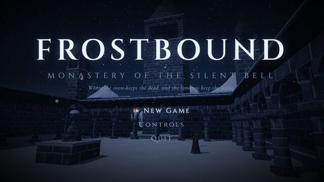</a><br><b>#5 <a href="https://az9713.github.io/opus-5.5-builds/builds/05-frostbound-monastery/index.html">Frostbound Monastery</a></b> — ▶ Play<br>Soulslike game in a snowbound monastery<br><sub>Original: Dark Souls-style game, by <a href="https://x.com/The_Alex">@The_Alex</a></sub></td>
<td width="33%" valign="top"><a href="https://az9713.github.io/opus-5.5-builds/builds/06-volcano-test/index.html">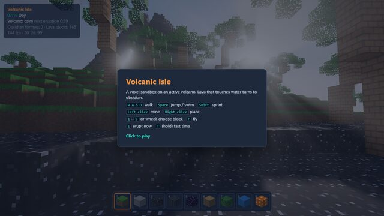</a><br><b>#6 <a href="https://az9713.github.io/opus-5.5-builds/builds/06-volcano-test/index.html">The Volcano Test</a></b> — ▶ Play<br>Volcanic island sandbox<br><sub>Original: "The Minecraft Test", by <a href="https://x.com/noahwachnik">@noahwachnik</a></sub></td>
</tr>
<tr>
<td width="33%" valign="top"><a href="https://az9713.github.io/opus-5.5-builds/builds/07-storm-lighthouse/storm_lighthouse_final.mp4">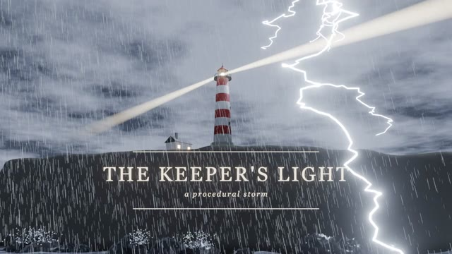</a><br><b>#7 <a href="https://az9713.github.io/opus-5.5-builds/builds/07-storm-lighthouse/storm_lighthouse_final.mp4">Storm Lighthouse</a></b> — ▶ Watch · <a href="https://az9713.github.io/opus-5.5-builds/builds/07-storm-lighthouse/build_timelapse.mp4">time-lapse</a><br>Procedural Blender scene (12.5 s render)<br><sub>Original: Procedural Blender castle, by <a href="https://x.com/Stefan_3D_AI">@Stefan_3D_AI</a></sub></td>
<td width="33%" valign="top"><a href="https://az9713.github.io/opus-5.5-builds/builds/08-pixel-dragon/index.html">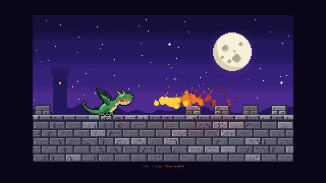</a><br><b>#8 <a href="https://az9713.github.io/opus-5.5-builds/builds/08-pixel-dragon/index.html">Pixel Dragon</a></b> — ▶ Play<br>Pixel art drawn in pure code<br><sub>Original: Pixel-art wizard, by <a href="https://x.com/majidmanzarpour">@majidmanzarpour</a></sub></td>
<td width="33%" valign="top"><a href="https://az9713.github.io/opus-5.5-builds/builds/09-rosetta-stone/index.html">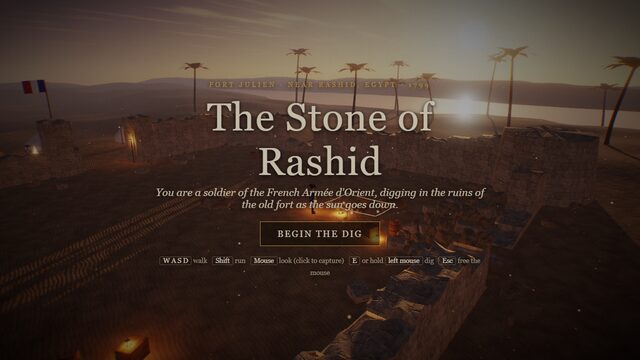</a><br><b>#9 <a href="https://az9713.github.io/opus-5.5-builds/builds/09-rosetta-stone/index.html">The Stone of Rashid</a></b> — ▶ Play<br>Rosetta Stone puzzle game<br><sub>Original: Antikythera mechanism game, by <a href="https://x.com/edwinarbus">@edwinarbus</a></sub></td>
</tr>
<tr>
<td width="33%" valign="top"><a href="https://az9713.github.io/opus-5.5-builds/builds/10-wave-racer/index.html">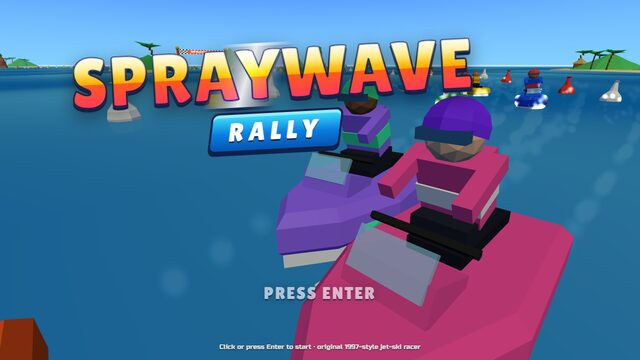</a><br><b>#10 <a href="https://az9713.github.io/opus-5.5-builds/builds/10-wave-racer/index.html">Spraywave Rally</a></b> — ▶ Play<br>One-shot jet-ski racer<br><sub>Original: Kart racer, by <a href="https://x.com/bridgemindai">@bridgemindai</a></sub></td>
<td width="33%" valign="top"><a href="https://az9713.github.io/opus-5.5-builds/builds/11-arch-bridge/index.html">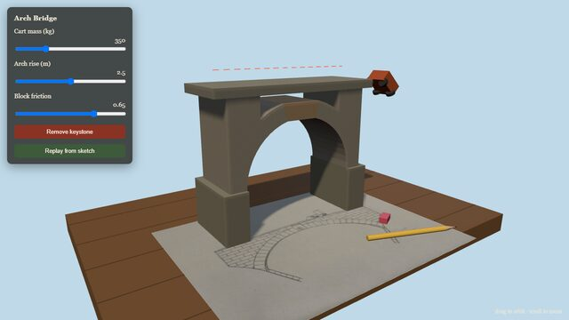</a><br><b>#11 <a href="https://az9713.github.io/opus-5.5-builds/builds/11-arch-bridge/index.html">Arch Bridge</a></b> — ▶ Play<br>Pencil sketch to 3D stone arch bridge, with physics<br><sub>Original: Sketch to 3D trebuchet, by <a href="https://x.com/poolio">@poolio</a></sub></td>
<td width="33%" valign="top"><a href="#12-snow-day-runs-on-your-pc">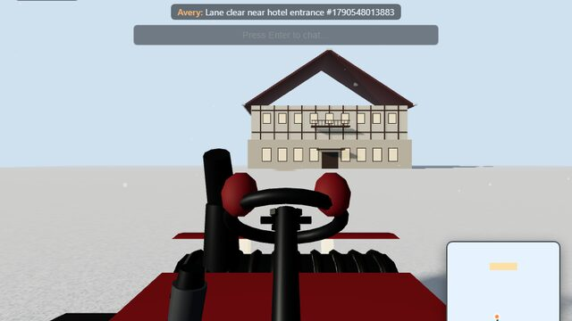</a><br><b>#12 <a href="#12-snow-day-runs-on-your-pc">Snow Day</a></b> — Local only (see below)<br>First-person multiplayer snow clearing<br><sub>Original: Multiplayer lawn mowing, by <a href="https://x.com/_MaxBlade">@_MaxBlade</a></sub></td>
</tr>
<tr>
<td width="33%" valign="top"><a href="https://az9713.github.io/opus-5.5-builds/builds/13-four-seasons-glass/index.html">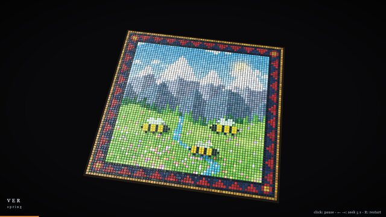</a><br><b>#13 <a href="https://az9713.github.io/opus-5.5-builds/builds/13-four-seasons-glass/index.html">Four Seasons in Glass</a></b> — ▶ Play<br>Glass-tile mosaic film, spring into winter<br><sub>Original: Glass-tile mosaic film, by <a href="https://x.com/LCSlates">@LCSlates</a></sub></td>
<td width="33%" valign="top"><a href="https://az9713.github.io/opus-5.5-builds/builds/14-japan-rail-sketchbook/index.html">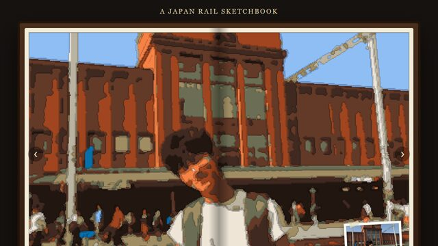</a><br><b>#14 <a href="https://az9713.github.io/opus-5.5-builds/builds/14-japan-rail-sketchbook/index.html">A Japan Rail Sketchbook</a></b> — ▶ Play<br>A trip drawn in acrylic marker<br><sub>Original: New Zealand trip in markers, by <a href="https://x.com/ann_nnng">@ann_nnng</a></sub></td>
<td width="33%" valign="top"><a href="https://az9713.github.io/opus-5.5-builds/builds/15-silk-road-sand/index.html">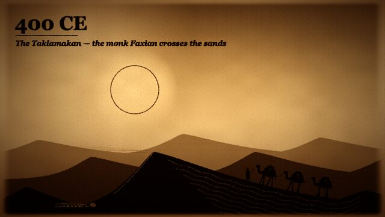</a><br><b>#15 <a href="https://az9713.github.io/opus-5.5-builds/builds/15-silk-road-sand/index.html">Silk Road in Sand</a></b> — ▶ Play<br>Sand-art film, 130 BCE to 1453 CE (120 s)<br><sub>Original: Sand-art film of US history, by <a href="https://x.com/Michaelzsguo">@Michaelzsguo</a></sub></td>
</tr>
</table>

Turn on sound for #2, #3, #4 and #15. They have music.

### #12 Snow Day runs on your PC

Snow Day needs a Node.js WebSocket server, so GitHub Pages cannot host it. Run it locally:

1. Open a terminal in `builds/12-snow-day/`.
2. Run `npm install`.
3. Run `npm start`. The server prints `listening on http://localhost:3512`.
4. Open `http://localhost:3512/?name=Alice` in one browser window.
5. Open `http://localhost:3512/?name=Bob` in a second window. Each window is one player.

More detail is in [`builds/12-snow-day/README.md`](builds/12-snow-day/README.md).

## Run locally

Clone the repo, then open any `builds/NN-*/index.html` through a local web server.
Some builds load ES modules, and browsers block those from `file://`.

```
python -m http.server 8000
```

Then open `http://localhost:8000/builds/01-eye-lab/index.html` (change the folder name for the other builds).

## Rebuild from source

The committed files already play. Rebuild only when you change the source.

| # | Command (run in the build folder) | Output |
|---|---|---|
| 2 | `npm install`, then `node compose.mjs`, then `node render.mjs` | `assets/shanty.wav`, `assets/timing.js`, `out/clawd-goes-to-sea.mp4` (needs Chrome and ffmpeg) |
| 7 | `blender -b -P build_scene.py`, then `blender -b storm_lighthouse.blend -P render_final.py` (Blender 5.2) | `storm_lighthouse.blend`, `screenshots/`, `frames/` (encode the frames to MP4 with ffmpeg) |
| 11 | `npm install`, then `node build/build.js` | `bundle.js` |
| 14 | `node build.js` | `index.html` (from `template.html` and `photos/`) |

Not in the repo, because they are large or can be made again: `node_modules/`, the #2 frame folder and `shanty.wav`, the #7 frame folder, Blender cache and `.blend` files.
The committed #2 MP4 is a smaller re-encode (24.7 MB, 1280×720, 150 s). `node render.mjs` writes the full-quality file.

## Known limits

Each build was checked against the "Check" lines in the specs file. These items did not fully pass:

- **#4** — the spec asks for max effort; the build did not use max effort.
- **#5** — the Tower, Bridge and Summit area banners were not tested with real input.
- **#11** — removing the keystone drops only the crown of the arch; the haunches and deck stay up.
- **#12** — the look is low-poly, not photoreal; there is no mouse-look.
- **#14** — one distant walker in the Arashiyama page is lost in the marker filter.
- **#15** — the spec asks for "one prompt, no edits"; the build was resumed once.
- **#2, #3, #15** — the music was generated but not reviewed by ear.

## Credits

- Reference video: [Top 15 Things built with Claude OPUS 5.5](https://www.youtube.com/watch?v=dw4rYWy8nLw), Code Bear.
- Original builds: the 15 creators named in the table. Their posts are linked in the video description.
- Builds in this repo: made with Claude Opus 5.5 in Claude Code. The #11 sketch and the #14 photos are AI images made with Higgsfield Soul 2.0.
